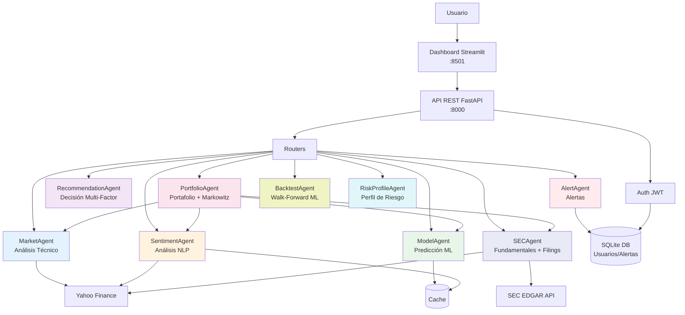
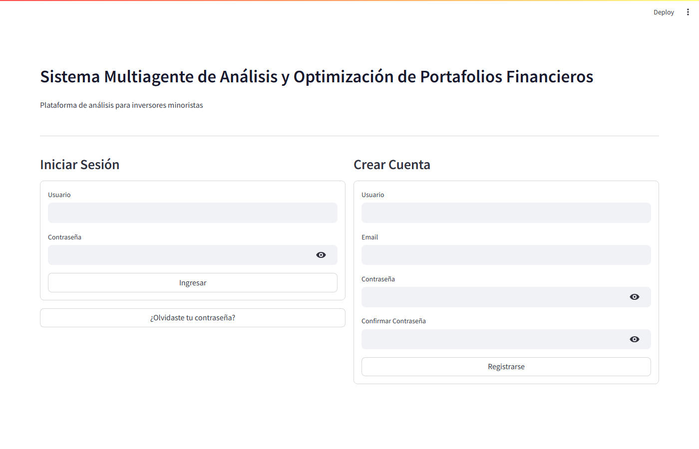
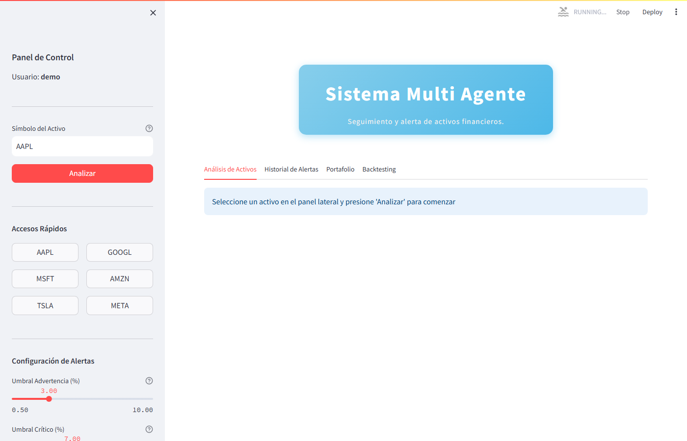
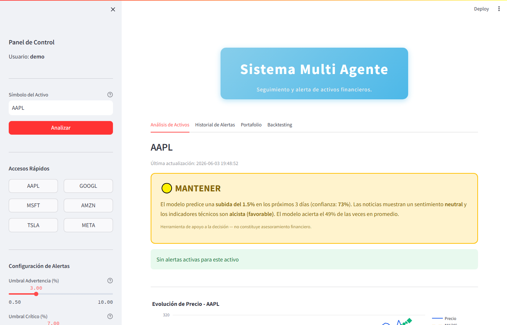
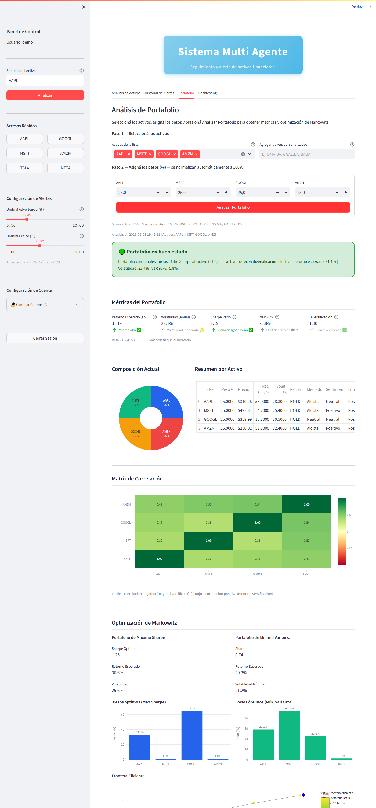
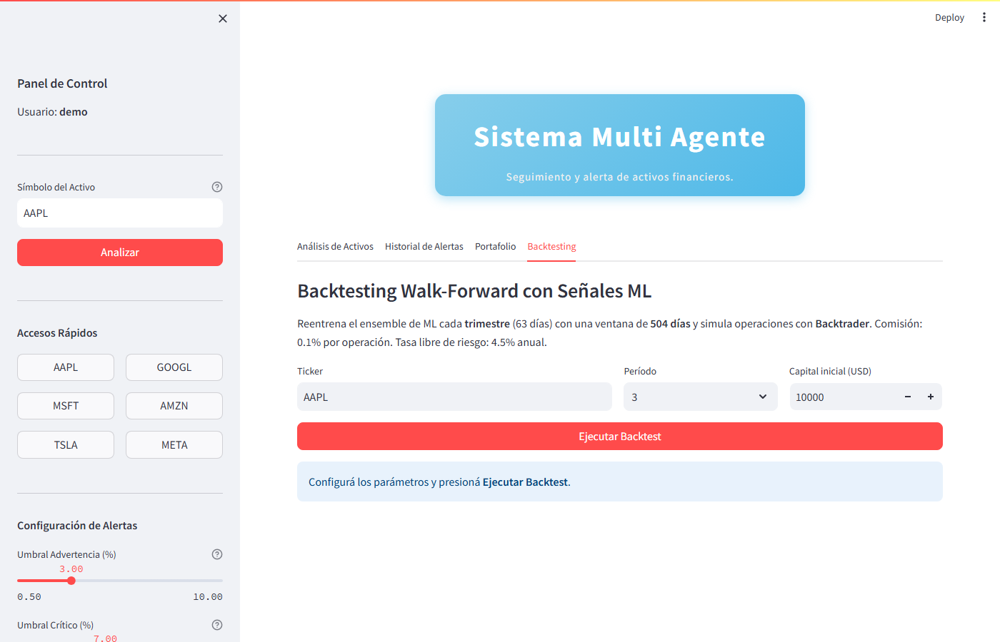

# Sistema Multiagente de Análisis y Optimización de Portafolios Financieros

Tesis Final — Maestría en Finanzas, Universidad Nacional de Rosario (UNR)

**Autora:** Ing. María Fabiana Cid &nbsp;|&nbsp; **Director:** Ph.D. Luciano Machain (UNR)

[](https://www.python.org/downloads/)
[](https://fastapi.tiangolo.com/)
[](https://streamlit.io/)
[](LICENSE)


## Tabla de Contenidos

- [Descripción](#descripción)
- [Arquitectura](#arquitectura)
  - [Diagrama del Sistema](#diagrama-del-sistema)
  - [Flujo de Análisis Completo](#flujo-de-análisis-completo)
  - [Agentes Especializados](#agentes-especializados)
- [Tecnologías](#tecnologías)
- [Estructura del Proyecto](#estructura-del-proyecto)
- [Instalación](#instalación)
- [Ejecución](#ejecución)
- [Dashboard Interactivo](#dashboard-interactivo)
- [Uso](#uso)
- [API Endpoints](#api-endpoints)
  - [Autenticación](#autenticación)
  - [Predicción y Análisis](#predicción-y-análisis)
  - [Portafolio](#portafolio)
  - [Alertas](#alertas)
  - [Estado del Sistema](#estado-del-sistema)
- [Características de Seguridad](#características-de-seguridad)
- [Testing y Resultados](#testing-y-resultados)
  - [Suite de Pruebas Automatizadas](#suite-de-pruebas-automatizadas)
  - [Validación Estadística — Test de Diebold-Mariano](#validación-estadística--test-de-diebold-mariano)
- [Troubleshooting](#troubleshooting)
- [Extensiones Futuras](#extensiones-futuras)
- [Autor](#autor)
- [Licencia](#licencia)


## Descripción

Este proyecto implementa un sistema multiagente que integra:

- **Obtención de datos de mercado** mediante yfinance (datos reales, sin simulaciones)
- **Análisis técnico** con 35+ indicadores y detección de anomalías
- **Predicción de dirección de precios** con ensemble de 4 modelos base + 3 opcionales de clasificación ML
- **Análisis de sentimiento** con 4 métodos NLP
- **Datos fundamentales y filings SEC**: ratios financieros (P/E, ROE, márgenes, crecimiento) y acceso a la API pública de SEC EDGAR para 10-K, 10-Q y 8-K
- **Perfil de riesgo del inversor**: cuestionario de 6 dimensiones (edad, horizonte, ingresos, tolerancia a pérdidas, experiencia, objetivo) → 5 perfiles (muy conservador … muy agresivo), selección dinámica de ETFs desde universo de 22 activos con filtro de correlación y piso defensivo
- **Análisis de portafolio**: métricas media-varianza, optimización de Markowitz (máximo Sharpe, mínima varianza), **Hierarchical Risk Parity (HRP)** (López de Prado, 2016), frontera eficiente y alertas de concentración/correlación
- **Backtesting walk-forward**: evaluación histórica de señales ML con Backtrader (activo individual) y simulación histórica de portafolio con rebalanceo periódico, costos de transacción y recálculo walk-forward de pesos (Máx Sharpe y HRP)
- **Explicabilidad ML**: SHAP values (Lundberg & Lee, 2017), MDI (Mean Decrease Impurity) y MDA (Mean Decrease Accuracy) — tres métricas de importancia de features sobre el mismo Random Forest
- **Generación de recomendaciones** explicables multi-factor
- **Sistema de alertas** con umbrales configurables
- **Validación estricta de tickers** - rechaza símbolos inválidos con error HTTP 404

## Arquitectura

### Diagrama del Sistema



### Flujo de Análisis Completo

```
┌─────────────────────────────────────────────────────────────────┐
│ Usuario solicita análisis de ticker (ej: AAPL)                 │
└─────────────────────────┬───────────────────────────────────────┘
                          ▼
         ┌────────────────────────────────────┐
         │  1. MarketAgent                    │
         │  • Descarga datos históricos       │
         │  • Calcula 35+ indicadores técnicos│
         │  • SMA, EMA, RSI, MACD, Bollinger  │
         │  • Score técnico ponderado         │
         └────────────┬───────────────────────┘
                      ▼
         ┌────────────────────────────────────┐
         │  2. ModelAgent                     │
         │  • Clasificación de dirección (3d) │
         │  • Ensemble de 4 base + 3 opcionales│
         │  • Linear, Ridge, RF, GBM          │
         │  • + XGBoost, LightGBM, LSTM (opt) │
         │  • Ventana: 504 días (2 años)      │
         │  • Métricas: Accuracy, Precision,  │
         │    Recall, F1, AUC                 │
         └────────────┬───────────────────────┘
                      ▼
         ┌────────────────────────────────────┐
         │  3. SentimentAgent                 │
         │  • Análisis de 7 noticias recientes│
         │  • FinBERT + VADER + TextBlob      │
         │  • Score de sentimiento ponderado  │
         │  • Detección de tendencia          │
         └────────────┬───────────────────────┘
                      ▼
         ┌────────────────────────────────────┐
         │  4. RecommendationAgent            │
         │  • Integra señales anteriores      │
         │  • Análisis de riesgo (VaR 95%)    │
         │  • Position sizing (Kelly)         │
         │  • Recomendación: Compra/Venta     │
         └────────────┬───────────────────────┘
                      ▼
         ┌────────────────────────────────────┐
         │  5. AlertAgent                     │
         │  • Evalúa umbrales (3% / 7%)       │
         │  • Genera alertas si necesario     │
         │  • Persiste en base de datos       │
         └────────────┬───────────────────────┘
                      │ (paralelo con pasos 1+3)
         ┌────────────▼───────────────────────┐
         │  6. SECAgent                       │
         │  • Ratios fundamentales (yfinance) │
         │  • P/E, P/B, ROE, ROA, márgenes    │
         │  • Crecimiento de ingresos/EPS     │
         │  • Deuda/Capital, liquidez (CR/QR) │
         │  • Filings recientes SEC EDGAR     │
         │  • Score fundamental -1 a +1       │
         └────────────┬───────────────────────┘
                      ▼
         ┌────────────────────────────────────┐
         │  Respuesta JSON completa           │
         │  + sec_data incluido               │
         │  + Dashboard visualiza resultados  │
         └────────────────────────────────────┘

Flujo de backtesting walk-forward:

         POST /backtest/{ticker}?years=3&initial_cash=10000
                      ▼
         ┌────────────────────────────────────┐
         │  BacktestAgent                     │
         │  • Descarga datos históricos       │
         │  • Genera señales walk-forward     │
         │    (reentrenamiento trimestral,    │
         │     ventana 504 días)              │
         │  • MLSignalStrategy (Backtrader)   │
         │    - Compra si prob_subida ≥ 0.54  │
         │    - Venta si prob_subida ≤ 0.46   │
         │    - Comisión 0.1% por operación   │
         │  • Benchmarks comparativos:        │
         │    - Buy & Hold                    │
         │    - SMA Crossover 20/50           │
         │      (golden/death cross)          │
         │  • Métricas para los 3 escenarios: │
         │    CAGR, Sharpe, Sortino,          │
         │    max drawdown, Calmar,           │
         │    win rate, alpha, beta           │
         │  • Devuelve curva de equity        │
         │    (3 series) + log de operaciones │
         └────────────────────────────────────┘

Flujo adicional para análisis de portafolio:

         POST /portfolio/analyze
         {tickers: [...], weights: [...]}
                      ▼
         ┌────────────────────────────────────┐
         │  PortfolioAgent                    │
         │  • Ejecuta pipeline completo       │
         │    en paralelo para cada activo    │
         │  • Matriz de covarianza histórica  │
         │  • Retorno esperado anualizado     │
         │  • Volatilidad del portafolio      │
         │  • Sharpe ratio, VaR 95%/99%       │
         │  • Beta vs S&P 500                 │
         │  • Optimización Markowitz (scipy)  │
         │    - Máximo Sharpe                 │
         │    - Mínima varianza               │
         │    - Frontera eficiente (15 pts)   │
         │  • Alertas: concentración >40%,    │
         │    correlación >0.85, VaR elevado  │
         └────────────────────────────────────┘
```

### Agentes Especializados

1. **MarketAgent** 
   - Descarga datos históricos de Yahoo Finance
   - Calcula 35+ indicadores técnicos avanzados:
     - **Tendencia**: SMA, EMA, MACD, ADX, Ichimoku, Parabolic SAR
     - **Momentum**: RSI, Stochastic, Williams %R, ROC, CCI
     - **Volatilidad**: Bollinger Bands, ATR, Keltner Channels
     - **Volumen**: OBV, VWAP, MFI, ADL, CMF
   - **Detección de anomalías** con 5 algoritmos:
     - Z-Score, MAD, CUSUM, Isolation Forest, Volume Anomaly
   - Genera señales de mercado con scoring ponderado
   - Identifica régimen de mercado (trending/ranging)
   - Detecta soportes y resistencias

2. **ModelAgent**
   - **Modelo de clasificación** que predice dirección del precio (subida/bajada)
   - Ensemble con modelos base (siempre presentes):
     - LogisticRegression (Linear) — clasificador probabilístico
     - RidgeClassifier — calibrado con `CalibratedClassifierCV` para producir probabilidades
     - Random Forest Classifier
     - Gradient Boosting Classifier
   - Modelos opcionales (según librerías instaladas):
     - XGBoost Classifier (si xgboost disponible)
     - LightGBM Classifier (si lightgbm disponible)
     - LSTM (si pytorch disponible)
   - **Ensemble probabilístico efectivo**: todos los modelos contribuyen probabilidades — XGBoost calibra internamente (`binary:logistic`), el resto vía `CalibratedClassifierCV` (sigmoide)
   - **Calibración de probabilidades**: cada modelo (excepto XGBoost, que calibra internamente con `binary:logistic`) se calibra con `CalibratedClassifierCV` (método sigmoide, `cv='prefit'`), reservando ~20% de los datos finales para calibración
   - **Filtro de ruido en entrenamiento**: movimientos menores a ±0.5% se excluyen del target (zona neutra tratada como ruido de mercado)
   - Feature engineering con 52 características técnicas
   - Ventana de entrenamiento: **504 días** (2 años)
   - Horizonte de predicción: **3 días**
   - Walk-forward validation temporal con 5 splits y **embargo de 3 días** (`gap=3`) para evitar filtración del target futuro hacia el set de validación (López de Prado, 2018)
   - Selección del mejor modelo del ensemble por **F1-Score** (métrica principal para datasets desbalanceados)
   - Métricas de clasificación: **Accuracy**, **Precision**, **Recall**, **F1-Score**, **AUC-ROC**
   - Conversión de probabilidad a precio estimado usando volatilidad histórica
   - Expone `prob_subida` como campo explícito en la respuesta (probabilidad calibrada de subida)
   - **Importancia de features — tres métricas** sobre el Random Forest auxiliar:
     - **MDI** (Mean Decrease Impurity): importancia por reducción de Gini en entrenamiento
     - **MDA** (Mean Decrease Accuracy): importancia por permutación en validación temporal (López de Prado, 2018, Cap. 8); usa F1 como métrica base
     - **SHAP** (SHapley Additive exPlanations, Lundberg & Lee, 2017): `mean|SHAP value|` por feature sobre el set de validación con `TreeExplainer`; compatible con SHAP ≥ 0.41 (ndarray 3D `[:, :, 1]` para clase "subida")
   - **Selección de features MDI+MDA**: score combinado `0.6·MDI_norm + 0.4·MDA_norm`, filtra sobre la mediana (mínimo 10 features garantizados), reduciendo 52 → ~26 features

3. **SentimentAgent** 
   - Ensemble de modelos NLP:
     - **FinBERT** (40% peso) - Transformer especializado en finanzas
     - **VADER** (25% peso) - Análisis léxico
     - **TextBlob** (15% peso) - Polaridad general
     - **Léxico Financiero** (20% peso) - 500+ términos en español e inglés
   - Análisis de 7 noticias recientes de Yahoo Finance
   - **Filtro de relevancia**: noticias sin mención directa del ticker/empresa reciben peso reducido (40%) para evitar contaminación por noticias del mercado general
   - **Ponderación en dos niveles**:
     1. *Por modelo*: el score de cada noticia es promedio ponderado por `MODEL_WEIGHTS` (FinBERT 40%, VADER 25%, Léxico 20%, TextBlob 15%)
     2. *Por relevancia*: el score final es promedio ponderado de los scores de noticias por su relevancia al ticker
   - **Confianza normalizada**: se calcula como promedio ponderado por peso de modelo (no por cantidad de scores)
   - **Interpretación contextual**: si la tendencia contradice el sentimiento general (ej: sentimiento positivo pero tendencia deteriorando), la explicación lo señala explícitamente con advertencia de cautela
   - Detección de tendencia de sentimiento
   - Extracción de temas clave (earnings, M&A, regulatory)
   - Caché de 1 hora para optimizar

4. **RecommendationAgent** 
   - Sistema de decisión multi-factor con 15+ variables:
     - **Señales Técnicas** (40%): Tendencia, momentum, volatilidad, volumen
     - **Predicción** (35%): Score del modelo, confianza, acuerdo ensemble
     - **Sentimiento** (15%): Score NLP, tendencia, impacto noticias
     - **Riesgo** (10%): Sharpe ratio, régimen mercado, correlación
   - Gestión de riesgo:
     - Value at Risk (VaR) al 95%
     - Estimación de max drawdown
     - Evaluación de riesgos específicos
   - Position sizing con Kelly Criterion
   - 7 niveles de recomendación (Compra Fuerte → Venta Fuerte)
   - Explicabilidad completa de cada factor

5. **AlertAgent** 
   - Evaluación de umbrales configurables:
     - **Warning**: 3% de variación
     - **Critical**: 7% de variación
   - Persistencia en base de datos con timestamps
   - 6 niveles de severidad: Info / Low / Medium / High / Critical / Emergency
   - Gestión de alertas leídas/no leídas
   - Integrable con notificaciones push/email

6. **SECAgent**
   - **Ratios fundamentales** vía `yfinance.info`:
     - Valuación: P/E, P/B, P/S, EV/EBITDA
     - Rentabilidad: ROE, ROA, margen bruto, operativo y neto
     - Crecimiento: crecimiento de ingresos y ganancias (YoY)
     - Deuda y liquidez: Deuda/Capital, Current Ratio, Quick Ratio
     - Mercado: Beta, Market Cap, Dividend Yield
   - **Balance resumido**: ingresos TTM, utilidad neta, flujo de caja libre, deuda total, efectivo
   - **Filings SEC EDGAR** (API pública gratuita):
     - Consulta automática del CIK por ticker
     - Recupera los filings más recientes: 10-K, 10-Q, 8-K, DEF 14A
     - Incluye fecha, tipo y descripción de cada filing
   - **Score fundamental** (-1 a +1) con señal positivo/neutral/negativo
   - Caché de 2 horas para minimizar llamadas externas
   - Integrado en `GET /predict/{ticker}` como paso paralelo (param `incluir_sec=true`)

7. **PortfolioAgent**
   - Orquesta todos los agentes anteriores en paralelo (ThreadPoolExecutor) para cada activo
   - **Retorno esperado**: `E[rᵢ] = 0.7 · r_hist + 0.3 · r_ml` (blending histórico + predicción ML)
   - **Métricas de portafolio** (teoría moderna de carteras):
     - Volatilidad del portafolio: `σp = √(wᵀ Σ w)` con fallback correlación 0.3
     - Ratio de Sharpe: `(Rp - Rf) / σp`, con `Rf = 4.5%` anual
     - VaR paramétrico al 95% y 99%
     - Ratio de diversificación y beta del portafolio vs S&P 500
     - Matriz de correlación histórica (2 años)
   - **Optimización de Markowitz** (scipy.optimize SLSQP):
     - Portafolio de máximo Sharpe (pesos ∈ [1%, 65%], Σwᵢ=1)
     - Portafolio de mínima varianza
     - Frontera eficiente (15 puntos equiespaciados)
   - **Hierarchical Risk Parity (HRP)** (López de Prado, 2016):
     - Distancia de correlación → clustering jerárquico single-linkage → quasi-diagonalización (`leaves_list`) → bisección recursiva por varianza de cluster
     - No invierte la matriz de covarianza — más robusto ante matrices mal condicionadas que Markowitz
     - Se expone como tercer portafolio óptimo junto a Max Sharpe y Mín. Varianza
   - **Alertas de portafolio**: concentración >40%, correlación >0.85, VaR <-20%, Sharpe negativo
   - Endpoint: `POST /portfolio/analyze`

9. **RiskProfileAgent**
   - Cuestionario de 6 dimensiones con scoring ponderado → 5 perfiles (muy conservador, conservador, moderado, agresivo, muy agresivo)
   - **Selección dinámica de ETFs**: evalúa universo de 22 ETFs con datos históricos reales (yfinance), score combinado `(1-agresividad)·Sharpe_norm + agresividad·Retorno_norm`
   - **Filtro de correlación greedy**: umbral configurable por perfil (0.75–0.95); descarta ETFs altamente correlacionados con los ya seleccionados (evita pares como IWM/MDY con correlación 0.95)
   - **Piso defensivo**: garantiza al menos un ETF defensivo (BND/TLT/IEF/LQD/GLD/XLU/XLP) para perfiles no agresivos
   - **Presupuesto de riesgo por perfil**: VaR máximo tolerado, volatilidad anual objetivo y peso máximo por activo (`max_peso_activo`)
   - Integración con PortfolioAgent usando restricciones del perfil (peso máximo propagado a Markowitz y HRP)
   - Endpoints: `POST /risk/profile` (evaluar cuestionario) · `POST /risk/portfolio` (análisis optimizado para el perfil)

8. **BacktestAgent**
   - Evaluación histórica walk-forward de señales ML usando **Backtrader** (modo activo individual)
   - Backtesting de portafolio: simulación histórica con deriva de pesos de mercado (sin rebalanceo fijo), rebalanceo periódico configurable (mensual/trimestral/semestral/anual), costos de transacción (compra inicial + cada rebalanceo), recálculo walk-forward de pesos Máx Sharpe y HRP usando solo datos anteriores al punto de evaluación
   - **Protocolo**: ventana de entrenamiento 504 días (TRAIN_WINDOW), paso trimestral 63 días (STEP)
   - **MLSignalStrategy**: compra si `prob_subida ≥ 0.54`; venta si `≤ 0.46`; comisión 0.1%
   - **Dos benchmarks comparativos** (misma comisión 0.1%, mismo capital inicial):
     - **Buy & Hold**: compra al inicio y mantiene durante todo el período
     - **SMA Crossover (20/50)**: compra en golden cross (SMA20 cruza sobre SMA50), vende en death cross — estrategia técnica básica sin ML
   - **Métricas calculadas** para los tres escenarios (ML, Buy & Hold, SMA Crossover):
     - CAGR, Sharpe ratio, Sortino ratio, max drawdown, Calmar ratio
     - Win rate, PnL promedio por operación, alpha y beta
   - Devuelve curva de equity diaria con tres series (ML / B&H / SMA) + log de operaciones
   - Sin data leakage: cada período usa solo datos anteriores al punto de evaluación
   - Endpoint: `POST /backtest/{ticker}?years=3&initial_cash=10000`

## Tecnologías

- **Backend**: FastAPI, SQLAlchemy, Pydantic
- **ML**: scikit-learn, XGBoost, LightGBM, pandas, numpy
- **Explicabilidad ML**: shap (TreeExplainer — SHAP values, MDI, MDA)
- **Optimización**: scipy (Markowitz, HRP, frontera eficiente)
- **Backtesting**: Backtrader (walk-forward, MLSignalStrategy)
- **Datos de mercado**: yfinance
- **Datos fundamentales**: yfinance (ratios), SEC EDGAR API pública (filings)
- **NLP**: FinBERT, VADER, TextBlob, léxico financiero
- **Frontend**: Streamlit, Plotly
- **Seguridad**: JWT, bcrypt

## Estructura del Proyecto

```
proyecto_final/
├── backend/
│   ├── __init__.py
│   ├── main.py              # Aplicación FastAPI
│   ├── config.py            # Configuración
│   ├── database.py          # Modelos SQLAlchemy
│   ├── schemas.py           # Schemas Pydantic
│   ├── auth.py              # Autenticación JWT
│   ├── email_service.py     # Servicio de email (recuperación de contraseña)
│   ├── routers/
│   │   ├── auth_router.py      # Endpoints de autenticación
│   │   ├── predict_router.py   # Endpoints de predicción (activo individual)
│   │   ├── alerts_router.py    # Endpoints de alertas
│   │   └── portfolio_router.py # Endpoints de análisis de portafolio
│   ├── routers/
│   │   ├── auth_router.py          # Endpoints de autenticación
│   │   ├── predict_router.py       # Endpoints de predicción (activo individual)
│   │   ├── alerts_router.py        # Endpoints de alertas
│   │   ├── portfolio_router.py     # Endpoints de análisis de portafolio
│   │   ├── backtest_router.py      # Endpoints de backtesting walk-forward
│   │   └── risk_router.py          # Endpoints de perfil de riesgo (/risk/profile, /risk/portfolio)
│   └── agents/
│       ├── market_agent.py         # Datos de mercado e indicadores técnicos
│       ├── model_agent.py          # Predicción ML (ensemble)
│       ├── sentiment_agent.py      # Análisis NLP de sentimiento
│       ├── recommendation_agent.py # Decisión multi-factor
│       ├── alert_agent.py          # Evaluación de umbrales y alertas
│       ├── sec_agent.py            # Fundamentales (yfinance) + filings SEC EDGAR
│       ├── portfolio_agent.py      # Análisis y optimización de portafolio
│       ├── backtest_agent.py       # Backtesting walk-forward con Backtrader
│       └── risk_profile_agent.py   # Cuestionario de perfil de riesgo + selección dinámica de ETFs
├── dashboard/
│   └── app.py               # Dashboard Streamlit
├── docs/
│   └── ANEXO_TECNICO_CALCULOS.md  # Fórmulas y cálculos técnicos del sistema
├── tests/                    # Suite de pruebas
│   ├── __init__.py
│   ├── test_functional.py        # Pruebas funcionales (30 tests)
│   ├── test_performance.py       # Pruebas de carga
│   └── test_diebold_mariano.py   # Validación estadística — DM test (Harvey et al. 1997)
├── test_results/             # Resultados de pruebas
│   ├── graficos/                          # Gráficos (PDF/PNG)
│   ├── dm_test_20260622_112731.json       # DM test — 2 años (5 tickers, sin régimen)
│   ├── dm_test_20260622_114812.json       # DM test — 2 años con análisis por régimen
│   ├── dm_test_4y_20260622_121830.json    # DM test — 4 años, ciclo completo 2022-2026
│   └── *.json                             # Otros resultados en JSON
├── requirements.txt
├── requirements-test.txt     # Dependencias de testing
├── run_all_tests.bat        # Script Windows para ejecutar tests
├── run_all_tests.sh         # Script Linux/Mac para ejecutar tests
├── manage_services.sh       # Script de gestión de servicios (start/stop/restart)
├── check_setup.py           # Verificación de instalación
├── reset_password_helper.py # Utilidad para reset de contraseña vía consola
├── test_reset_flow.py       # Prueba del flujo de recuperación de contraseña
├── VALIDACION_ACADEMICA.md  # Validación académica: fundamentos, estado del arte y métricas
├── INFORME_PRUEBAS.md       # Informe detallado de resultados de pruebas
├── CONFIGURATION.md         # Configuración avanzada y deployment
├── EXAMPLES.md              # Ejemplos prácticos de uso
├── .env.example
└── README.md
```

## Instalación

### 1. Clonar el repositorio

```bash
cd proyecto_final
```

### 2. Crear entorno virtual

```bash
python -m venv venv

# Windows
venv\Scripts\activate

# Linux/Mac
source venv/bin/activate
```

### 3. Instalar dependencias

```bash
pip install -r requirements.txt
```

### 4. Configurar variables de entorno

```bash
# Copiar el archivo de ejemplo
cp .env.example .env

# Editar .env con tu editor favorito
nano .env  # o vim, code, notepad++, etc.
```

** IMPORTANTE:** El archivo `.env` contiene información sensible y **NO DEBE** ser commiteado a git (ya está en `.gitignore`).

#### Variables Críticas (DEBES configurar):

**`SECRET_KEY`** - Clave secreta para firmar tokens JWT
```bash
# Generar una clave segura ejecutando en terminal:
python -c "import secrets; print(secrets.token_urlsafe(32))"

# O con openssl:
openssl rand -hex 32

# Copiar el resultado a .env:
SECRET_KEY=tu_clave_generada_aqui
```

#### Variables Opcionales (pueden usar valores por defecto):

| Variable | Descripción | Default | Ejemplo |
|----------|-------------|---------|---------|
| `ALGORITHM` | Algoritmo de firma JWT | `HS256` | `HS256` |
| `ACCESS_TOKEN_EXPIRE_MINUTES` | Expiración de token | `30` | `30` |
| `DATABASE_URL` | Conexión a base de datos | SQLite local | `sqlite:///./financial_tracker.db` |
| `ALERT_THRESHOLD_WARNING` | Umbral alerta warning (%) | `3.0` | `3.0` |
| `ALERT_THRESHOLD_CRITICAL` | Umbral alerta crítica (%) | `7.0` | `7.0` |
| `SMTP_SERVER` | Servidor email (opcional) | - | `smtp.gmail.com` |
| `SMTP_PORT` | Puerto SMTP (opcional) | - | `587` |
| `SMTP_USER` | Usuario email (opcional) | - | `tu_email@gmail.com` |
| `SMTP_PASSWORD` | Contraseña de aplicación (opcional) | - | `tu_app_password` |

**Nota sobre SMTP:**
- **Sin SMTP configurado**: El sistema funciona normalmente. Los tokens de recuperación de contraseña aparecen en los logs del backend.
- **Con SMTP configurado**: Los tokens se envían automáticamente por email para mejor experiencia de usuario.

### 5. Verificar la instalación (Recomendado)

Ejecuta el script de verificación para asegurarte de que todo está configurado correctamente:

```bash
python check_setup.py
```

El script verificará:
-  Versión de Python (3.8+)
-  Dependencias instaladas
-  Estructura del proyecto
-  Configuración del archivo .env
-  Puertos disponibles (8000, 8501)

**Salida esperada:**
```
 VERIFICACIÓN DE INSTALACIÓN
Sistema Multiagente de Seguimiento Financiero

============================================================
  Verificando Python
============================================================
 Versión de Python: 3.10.0 (OK)

============================================================
  Verificando Dependencias Principales
============================================================
 FastAPI: Instalado
 Uvicorn: Instalado
...

============================================================
  Resumen
============================================================
 ¡Todo está configurado correctamente!
   El sistema está listo para ejecutarse.
```

Si encuentras errores, el script te proporcionará instrucciones específicas para corregirlos.

---

## Ejecución

### Iniciar el Backend

```bash
uvicorn backend.main:app --reload --port 8000
```

El API estará disponible en:
- API: http://localhost:8000
- Documentación Swagger: http://localhost:8000/docs
- Documentación ReDoc: http://localhost:8000/redoc

### Iniciar el Dashboard

En otra terminal:

```bash
streamlit run dashboard/app.py
```

El dashboard estará disponible en:
- http://localhost:8501

### Script de Gestión de Servicios (Linux/Mac)

Para facilitar la gestión de ambos servicios, puedes usar el script `manage_services.sh`:

```bash
# Iniciar backend + dashboard
bash manage_services.sh start

# Detener ambos servicios
bash manage_services.sh stop

# Reiniciar servicios
bash manage_services.sh restart

# Ver estado de los servicios
bash manage_services.sh status
```

**Nota:** Este script es para sistemas Unix/Linux/Mac. En Windows, inicia cada servicio en terminales separadas como se describe arriba.

---

## Dashboard Interactivo

El dashboard de Streamlit proporciona una interfaz visual completa para interactuar con el sistema:

###  Pantalla de Autenticación
- Login con usuario y contraseña
- Registro de nuevos usuarios
- Validación en tiempo real
- Sesión persistente con JWT

###  Análisis de Activos

**Búsqueda de Ticker:**
```
┌────────────────────────────────┐
│  Buscar Activo Financiero    │
│ ┌────────────────────────────┐ │
│ │ AAPL                    []││
│ └────────────────────────────┘ │
│                                │
│ Ejemplos: AAPL, TSLA, MSFT,   │
│          GOOGL, AMZN, META     │
└────────────────────────────────┘
```

**Panel de Análisis Técnico:**
- Gráfico de precio histórico con candlesticks (Plotly interactivo)
- Indicadores técnicos superpuestos:
  - Medias móviles (SMA 20, EMA 12)
  - Bandas de Bollinger
  - MACD
  - RSI
-  Score técnico visual (0-10)
-  Régimen de mercado actual

**Panel de Predicción:**
-  **Predicción de dirección** a 3 días (SUBIDA ⬆️ / BAJADA ⬇️)
-  Gráfico con proyección de 3 días (línea punteada)
-  Precio estimado basado en probabilidad y volatilidad
-  **Métricas de clasificación**:
  ```
  ✓ Accuracy: 57.0%    ✓ Precision: 60.7%
  ✓ Recall: 66.2%      ✓ F1-Score: 58.9%
  ```
-  Probabilidad de cada dirección por modelo individual
-  Contribución de cada modelo en el ensemble (pesos)
-  **Explicabilidad — "¿Qué variables impulsan esta predicción?"** (expander dentro de detalles del modelo):
   - Gráfico SHAP Top 10 features (violeta) — `mean |SHAP value|` sobre validación temporal
   - Gráfico MDI Top 10 features (verde) — Mean Decrease Impurity del mismo Random Forest
   - Ambas metodologías con citas académicas (Lundberg & Lee 2017, López de Prado 2018)

**Panel de Sentimiento:**
-    Indicador visual de sentimiento
-  Lista de noticias analizadas con scores individuales
- Tendencia de sentimiento (mejorando/deteriorando/estable)
-  Temas clave identificados (earnings, M&A, regulatory)

**Panel de Recomendación:**
-    Indicador visual de acción (Compra/Mantener/Venta)
-  Nivel de confianza (barra de progreso)
- Explicación detallada de la recomendación
-  Análisis de riesgo:
  - VaR 95%
  - Max Drawdown estimado
  - Sharpe Ratio
-  Position Sizing sugerido:
  - Allocación recomendada (%)
  - Stop Loss
  - Take Profit
  - Risk/Reward Ratio

**Panel de Datos Fundamentales (SECAgent):**
- Se muestra al pie del análisis de activo (si `incluir_sec=true`)
- Tres columnas de ratios: Valuación (P/E, P/B, P/S, EV/EBITDA), Rentabilidad (ROE, ROA, márgenes), Crecimiento y Deuda
-  Signal fundamental: positivo / neutral / negativo con score -1 a +1
- Expander con Balance resumido (ingresos TTM, utilidad neta, FCL, deuda, efectivo)
- Expander con filings recientes de SEC EDGAR (10-K, 10-Q, 8-K) con badges de color por tipo
- Mensaje informativo para activos no-US sin CIK registrado en EDGAR

###  Perfil de Riesgo (tab 1 — nueva)

**Cuestionario de 6 dimensiones:**
- Edad, horizonte de inversión, estabilidad de ingresos, tolerancia a pérdidas, experiencia inversora y objetivo financiero
- Scoring ponderado → 5 perfiles: muy conservador / conservador / moderado / agresivo / muy agresivo
- Desglose visual por dimensión con interpretación de cada respuesta

**Selección dinámica de ETFs:**
- Evalúa universo de 22 ETFs con datos históricos reales (yfinance)
- Score combinado: `(1-agresividad)·Sharpe_norm + agresividad·Retorno_norm`
- Filtro de correlación greedy (umbral por perfil): descarta ETFs redundantes
- Piso defensivo: garantiza al menos un ETF defensivo (BND/TLT/GLD/XLU/XLP) para perfiles conservadores/moderados
- Muestra período de análisis, universo evaluado y señal de selección dinámica/predefinida por ETF

**Análisis del portafolio del perfil:**
- Métricas del portafolio en tiempo real (Sharpe, VaR, volatilidad, retorno)
- Semáforo de riesgo: verde/amarillo/rojo según VaR vs límite del perfil
- Gráfico comparativo: pesos del perfil vs Máx Sharpe vs HRP
- Tabla de acciones de rebalanceo separada por estrategia (Máx Sharpe y HRP)
- Explicación del Sharpe ML (predicciones corto plazo) vs Sharpe histórico (HRP)
- Señales del pipeline multiagente por ETF con expander explicativo de cada columna
- Botón de integración: transfiere ETFs y pesos a la pestaña **Portafolio** para análisis técnico adicional

###  Portafolio (tab 3)

**Formulario de portafolio:**
- Entrada de tickers separados por comas (ej: `AAPL, MSFT, GOOGL, AMZN`)
- Entrada de pesos separados por comas (se normalizan automáticamente a suma=1)
- Validación: mínimo 2, máximo 15 activos

**Panel de métricas del portafolio:**
```
┌──────────┬──────────┬──────────┬──────────┬──────────┐
│Retorno   │Volatili- │Sharpe    │VaR 95%   │Beta      │
│Esperado  │dad       │Ratio     │          │          │
│ 21.5%    │ 21.9%    │  0.78    │ -14.5%   │  1.10    │
└──────────┴──────────┴──────────┴──────────┴──────────┘
```

**Visualizaciones:**
- Gráfico de torta (Plotly): distribución de pesos por activo
- Tabla de activos con precio, retorno esperado, volatilidad, señales técnica/sentimiento/fundamental
- Mapa de calor de correlaciones (heatmap)
- Gráficos de barras comparativos: pesos actuales vs Máximo Sharpe (azul) vs Mínima Varianza (verde) vs **HRP** (ámbar)
- Frontera eficiente (15 puntos) con marcadores para portafolio actual, máx Sharpe, mín varianza y **punto HRP**
- Tabla comparativa con columnas separadas `Δ Max Sharpe` y `Δ HRP` (sin mezclar estrategias)
- Conclusión independiente por estrategia: acciones Máx Sharpe y acciones HRP en bloques separados con indicación del perfil adecuado para cada una
- Explicación del Sharpe ML vs histórico cuando el modelo supera al óptimo histórico
- Banner de **perfil estimado** basado en VaR 95% y volatilidad, con nota sobre qué complementa la pestaña Perfil de Riesgo

###  Centro de Alertas
```
╔════════════════════════════════════════╗
║   Alertas Activas                    ║
╠════════════════════════════════════════╣
║    TSLA - Variación crítica (-7.8%)  ║
║      $245.30 vs $265.50 predicho       ║
║      Hace 2 horas                  [✓] ║
╟────────────────────────────────────────╢
║    AAPL - Variación warning (+3.5%)  ║
║      $185.42 vs $179.20 predicho       ║
║      Hace 5 horas                  [✓] ║
╚════════════════════════════════════════╝
```

**Funcionalidades:**
- Lista de alertas con filtros (leídas/no leídas)
- Códigos de color por tipo (info/warning/critical)
- Marcar como leída con un click
- Estadísticas de alertas
- Historial completo

###  Estadísticas del Usuario
- Total de consultas realizadas
- Activos más consultados
- Historial de recomendaciones
- Precisión de predicciones pasadas

## Uso

### 1. Registro de Usuario

Desde el dashboard o via API:

```bash
curl -X POST http://localhost:8000/auth/register \
  -H "Content-Type: application/json" \
  -d '{"username": "usuario", "email": "usuario@email.com", "password": "password123"}'
```

### 2. Login

```bash
curl -X POST http://localhost:8000/auth/login \
  -d "username=usuario&password=password123"
```

### 3. Recuperar Contraseña (Sin SMTP Configurado)

Si olvidaste tu contraseña y no tienes SMTP configurado, sigue estos pasos:

#### Paso 1: Solicitar Token de Reseteo

Desde el dashboard o via API:

```bash
curl -X POST http://localhost:8000/auth/forgot-password \
  -H "Content-Type: application/json" \
  -d '{"email": "tu_email@example.com"}'
```

**Respuesta:**
```json
{
  "message": "Si el email está registrado, recibirás instrucciones para resetear tu contraseña.",
  "detail": "Por seguridad, no indicamos si el email existe o no."
}
```

#### Paso 2: Obtener el Token de los Logs

Como SMTP no está configurado, el token se imprime en los logs del backend. Busca en la consola donde ejecutaste `uvicorn` o en el archivo `logs/app.log`:

```bash
# Buscar en logs del backend
grep "Token de reseteo" logs/app.log

# Verás algo como:
# INFO - Token de reseteo para tu_usuario: ABC123XYZ456...
```

**Ejemplo del log:**
```
2026-02-06 14:12:11,167 - backend.email_service - INFO - Token de reseteo para demo_test: Id6SNF3G-Ua7ev4jvvHU0tb4WvkcdPoEAHujZzPob__3quId16e5e2kGFh0tEapA
```

**Copia el token completo** (la cadena después de los dos puntos).

#### Paso 3: Resetear la Contraseña con el Token

Usa el token para establecer una nueva contraseña:

```bash
curl -X POST http://localhost:8000/auth/reset-password \
  -H "Content-Type: application/json" \
  -d '{
    "token": "ABC123XYZ456...",
    "new_password": "NuevaPassword123!"
  }'
```

**Respuesta exitosa:**
```json
{
  "message": "Contraseña actualizada exitosamente",
  "detail": "Ya puedes iniciar sesión con tu nueva contraseña"
}
```

** Notas Importantes:**
- El token expira en 1 hora
- El token es de un solo uso
- Si SMTP está configurado, recibirás el token por email automáticamente

### 4. Análisis de Activo

```bash
curl -X GET http://localhost:8000/predict/AAPL \
  -H "Authorization: Bearer <token>"
```

### 5. Ver Alertas

```bash
curl -X GET http://localhost:8000/alerts \
  -H "Authorization: Bearer <token>"
```

## API Endpoints

### Autenticación

#### `POST /auth/register` - Registrar usuario
**Request:**
```json
{
  "username": "investor123",
  "email": "investor@example.com",
  "password": "SecurePass123!"
}
```

**Response:** `201 Created`
```json
{
  "id": 1,
  "username": "investor123",
  "email": "investor@example.com",
  "rol": "user",
  "fecha_registro": "2026-02-05T10:30:00"
}
```

#### `POST /auth/login` - Iniciar sesión
**Request:** (Form data)
```
username=investor123
password=SecurePass123!
```

**Response:** `200 OK`
```json
{
  "access_token": "eyJhbGciOiJIUzI1NiIsInR5cCI6IkpXVCJ9...",
  "token_type": "bearer",
  "expires_in": 1800
}
```

#### `GET /auth/me` - Obtener usuario actual
**Headers:** `Authorization: Bearer {token}`

**Response:** `200 OK`
```json
{
  "id": 1,
  "username": "investor123",
  "email": "investor@example.com",
  "rol": "user"
}
```

#### `POST /auth/refresh` - Refrescar token
**Headers:** `Authorization: Bearer {token}`

**Response:** `200 OK`
```json
{
  "access_token": "eyJhbGciOiJIUzI1NiIsInR5cCI6IkpXVCJ9...",
  "token_type": "bearer",
  "expires_in": 1800
}
```


### Predicción y Análisis

#### `GET /predict/{ticker}` - Análisis completo de activo individual
**Ejemplo:** `GET /predict/AAPL?incluir_sec=true`

**Query params:**
- `incluir_sec` (bool, default `true`): incluye datos fundamentales SEC en la respuesta
- `umbral_warning` (float): umbral de alerta personalizado (%)
- `umbral_critical` (float): umbral crítico personalizado (%)

**Headers:** `Authorization: Bearer {token}`

**Response:** `200 OK`
```json
{
  "ticker": "AAPL",
  "market_data": {
    "precio_actual": 185.42,
    "precio_max": 189.50,
    "precio_min": 182.30,
    "volumen": 52847300,
    "variacion_pct": 2.15,
    "sma_20": 183.45,
    "ema_12": 184.20,
    "rsi": 58.32,
    "macd": 1.45,
    "signal": 1.20,
    "bollinger_upper": 190.30,
    "bollinger_lower": 176.60,
    "volatilidad": 0.0245,
    "score_tecnico": 6.8,
    "señales": ["RSI neutral", "MACD bullish", "Precio sobre SMA20"],
    "regimen_mercado": "trending_up",
    "timestamp": "2026-02-05T14:30:00Z"
  },
  "prediction": {
    "precio_predicho": 188.75,
    "variacion_pct": 1.80,
    "horizonte_dias": 3,
    "modelo_usado": "ensemble_classification",
    "metricas": {
      "accuracy": 0.570,
      "precision": 0.607,
      "recall": 0.662,
      "f1": 0.589,
      "auc": 0.586
    },
    "modelos_detalle": {
      "predicciones": {
        "linear": 0.55,
        "ridge": 0.57,
        "random_forest": 0.88,
        "gradient_boosting": 0.85,
        "xgboost": 0.92,
        "lightgbm": 0.90
      },
      "pesos": {
        "linear": 0.12,
        "ridge": 0.13,
        "random_forest": 0.22,
        "gradient_boosting": 0.21,
        "xgboost": 0.16,
        "lightgbm": 0.16
      }
    },
    "parametros": {
      "ventana": 504,
      "n_features": 52,
      "n_features_sel": 26,
      "n_modelos": "4-7 (según librerías instaladas)",
      "mejor_modelo": "varía según ticker y entrenamiento",
      "method": "MDI+MDA"
    },
    "prob_subida": 0.6231,
    "features_importance": {"macd_hist": 0.033, "sma_50": 0.018, "bb_pct": 0.014},
    "mda_scores": {"roc_20": 0.021, "volatility_20": 0.018, "close_lag_1": 0.014},
    "shap_values": {"macd_hist": 0.033, "sma_50": 0.018, "bb_pct": 0.014, "ema_ratio_26": 0.013, "sma_ratio_50": 0.013}
  },
  "sec_data": {
    "ticker": "AAPL",
    "company_name": "Apple Inc.",
    "fundamental_signal": "positivo",
    "fundamental_score": 0.893,
    "resumen": "Fundamentales positivos: ROE=141.5%, P/E=37.5x, Rev.Growth=16.6%.",
    "disponible": true,
    "ratios": {
      "pe_ratio": 37.5,
      "pb_ratio": 42.7,
      "roe": 1.415,
      "roa": 0.298,
      "profit_margin": 0.272,
      "operating_margin": 0.315,
      "revenue_growth": 0.166,
      "earnings_growth": 0.243,
      "debt_to_equity": 1.45,
      "current_ratio": 0.87,
      "beta": 1.065,
      "market_cap": 4560000000000,
      "dividend_yield": 0.0044,
      "health_score": 9.5,
      "health_label": "positivo"
    },
    "balance": {
      "revenue_ttm": 451400000000,
      "net_income_ttm": 122800000000,
      "operating_cash_flow": 118300000000,
      "free_cash_flow": 101100000000,
      "total_debt": 97000000000,
      "cash_and_equivalents": 67000000000
    },
    "recent_filings": [
      {"form_type": "10-Q", "filing_date": "2026-05-01", "description": "10-Q", "accession_number": "0000320193-26-000055"},
      {"form_type": "8-K",  "filing_date": "2026-04-30", "description": "8-K", "accession_number": "0000320193-26-000052"}
    ]
  },
  "sentiment": {
    "score": 0.42,
    "categoria": "positivo",
    "tendencia": "mejorando",
    "noticias_analizadas": 7,
    "noticias": [
      {
        "titulo": "Apple Reports Record Q1 Earnings",
        "score": 0.78,
        "fuente": "Yahoo Finance",
        "fecha": "2026-02-04"
      }
    ],
    "temas_clave": ["earnings", "innovation", "market_expansion"],
    "confianza": 0.85
  },
  "recommendation": {
    "accion": "compra",
    "nivel": "moderado",
    "confianza": 0.82,
    "razon": "Señales técnicas alcistas combinadas con sentimiento positivo y predicción favorable",
    "factores": {
      "tecnico": {"score": 6.8, "peso": 0.40, "contribucion": 2.72},
      "prediccion": {"score": 7.5, "peso": 0.35, "contribucion": 2.63},
      "sentimiento": {"score": 6.5, "peso": 0.15, "contribucion": 0.98},
      "riesgo": {"score": 5.2, "peso": 0.10, "contribucion": 0.52}
    },
    "score_total": 6.85,
    "gestion_riesgo": {
      "var_95": 8750.50,
      "max_drawdown_estimado": 0.12,
      "sharpe_ratio": 1.85,
      "riesgos": ["volatilidad_moderada", "exposicion_sector_tech"]
    },
    "position_sizing": {
      "kelly_criterion": 0.08,
      "allocacion_sugerida_pct": 5.0,
      "stop_loss": 176.15,
      "take_profit": 195.80,
      "risk_reward_ratio": 2.5
    }
  },
  "alertas_generadas": [
    {
      "tipo": "info",
      "mensaje": "Precio actual dentro del rango esperado",
      "variacion_pct": 2.15
    }
  ],
  "timestamp": "2026-02-05T14:30:00Z"
}
```

#### `GET /predict/{ticker}/market` - Solo datos de mercado
**Response:** Retorna únicamente el objeto `market_data` del ejemplo anterior

#### `GET /predict/{ticker}/sentiment` - Solo sentimiento
**Response:** Retorna únicamente el objeto `sentiment` del ejemplo anterior


### Backtesting

#### `POST /backtest/{ticker}` - Backtest walk-forward con señales ML

**Ejemplo:** `POST /backtest/AAPL?years=3&initial_cash=10000`

**Query params:**
- `years` (int, 1-5, default `3`): período histórico a simular
- `initial_cash` (float, default `10000`): capital inicial en USD

**Headers:** `Authorization: Bearer {token}` (opcional)

**Response:** `200 OK`
```json
{
  "ticker": "AAPL",
  "start_date": "2023-06-03",
  "end_date": "2026-06-03",
  "initial_cash": 10000.0,
  "final_value": 12450.30,
  "benchmark_final": 11820.50,
  "sma_final": 11340.20,
  "signals_generated": 189,
  "buy_signals": 62,
  "sell_signals": 58,
  "metrics": {
    "total_return": 24.5,
    "cagr": 7.58,
    "sharpe_ratio": 0.821,
    "sortino_ratio": 1.143,
    "max_drawdown": -18.2,
    "calmar_ratio": 0.417,
    "num_trades": 58,
    "win_rate": 53.4,
    "avg_trade_pct": 0.42,
    "alpha": 2.31,
    "beta": 0.874
  },
  "benchmark_metrics": { "total_return": 18.2, "cagr": 5.73, "sharpe_ratio": 0.612 },
  "sma_metrics": {
    "total_return": 13.4,
    "cagr": 4.28,
    "sharpe_ratio": 0.541,
    "sortino_ratio": 0.782,
    "max_drawdown": -16.8,
    "calmar_ratio": 0.255,
    "num_trades": 12,
    "win_rate": 58.3,
    "avg_trade_pct": 1.12,
    "alpha": -1.55,
    "beta": 0.821
  },
  "equity_curve": [
    {"date": "2023-06-05", "value": 10000.0, "benchmark": 10000.0, "sma_crossover": 10000.0},
    {"date": "2023-06-06", "value": 10021.3, "benchmark": 10018.7, "sma_crossover": 10018.7}
  ],
  "trades": [
    {"date_open": "2023-06-12", "date_close": "2023-06-28",
     "entry_price": 184.50, "exit_price": 189.20, "pnl_pct": 2.55, "result": "ganancia"}
  ]
}
```

---

### Portafolio

#### `POST /portfolio/analyze` - Análisis completo de portafolio

**Headers:** `Authorization: Bearer {token}` (opcional)

**Request:**
```json
{
  "tickers": ["AAPL", "MSFT", "GOOGL", "AMZN"],
  "weights": [0.30, 0.30, 0.20, 0.20],
  "forzar_actualizacion": false
}
```

Los pesos se normalizan automáticamente a suma = 1. Se requieren mínimo 2 y máximo 15 activos.

**Response:** `200 OK`
```json
{
  "tickers": ["AAPL", "MSFT", "GOOGL", "AMZN"],
  "weights": {"AAPL": 0.30, "MSFT": 0.30, "GOOGL": 0.20, "AMZN": 0.20},
  "activos": [
    {
      "ticker": "AAPL",
      "weight": 0.30,
      "price": 310.23,
      "expected_return": 34.5,
      "volatility": 28.2,
      "tipo_recomendacion": "mantener",
      "senal_mercado": "neutral",
      "sentimiento": "positivo",
      "fundamental_signal": "positivo",
      "fundamental_score": 0.893,
      "variacion_pct": 0.56
    }
  ],
  "metricas": {
    "expected_return": 21.5,
    "volatility": 21.9,
    "sharpe_ratio": 0.776,
    "var_95": -14.5,
    "var_99": -29.4,
    "diversification_ratio": 1.298,
    "beta_portfolio": 1.095,
    "num_activos": 4,
    "correlation_matrix": {
      "AAPL": {"AAPL": 1.0, "MSFT": 0.41, "GOOGL": 0.44, "AMZN": 0.47},
      "MSFT": {"AAPL": 0.41, "MSFT": 1.0,  "GOOGL": 0.37, "AMZN": 0.54}
    }
  },
  "optimizacion": {
    "disponible": true,
    "max_sharpe_weights": {"AAPL": 0.33, "MSFT": 0.01, "GOOGL": 0.65, "AMZN": 0.01},
    "max_sharpe_return": 38.7,
    "max_sharpe_volatility": 25.5,
    "max_sharpe_sharpe": 1.340,
    "min_variance_weights": {"AAPL": 0.276, "MSFT": 0.495, "GOOGL": 0.219, "AMZN": 0.01},
    "min_variance_return": 19.2,
    "min_variance_volatility": 21.1,
    "hrp_weights": {"AAPL": 0.285, "MSFT": 0.481, "GOOGL": 0.234},
    "hrp_return": 17.1,
    "hrp_volatility": 22.0,
    "hrp_sharpe": 0.570,
    "efficient_frontier": [
      {"expected_return": 19.2, "volatility": 21.1, "sharpe": 0.69, "weights": {...}},
      {"expected_return": 38.7, "volatility": 25.5, "sharpe": 1.34, "weights": {...}}
    ]
  },
  "recomendacion_portafolio": "Portafolio con señales mixtas. Ratio Sharpe moderado. Los activos ofrecen diversificación efectiva...",
  "alertas": [],
  "fecha_analisis": "2026-05-22T13:11:00"
}
```

### Alertas

#### `GET /alerts` - Listar alertas del usuario
**Headers:** `Authorization: Bearer {token}`

**Query params:**
- `skip`: Número de registros a omitir (paginación)
- `limit`: Máximo de registros a retornar (default: 100)

**Response:** `200 OK`
```json
{
  "total": 23,
  "alertas": [
    {
      "id": 45,
      "ticker": "TSLA",
      "tipo": "critical",
      "mensaje": " Variación crítica detectada",
      "variacion_pct": -7.8,
      "precio_actual": 245.30,
      "precio_predicho": 265.50,
      "leida": false,
      "fecha_creacion": "2026-02-05T09:15:00Z"
    },
    {
      "id": 44,
      "ticker": "AAPL",
      "tipo": "warning",
      "mensaje": " Variación significativa detectada",
      "variacion_pct": 3.5,
      "precio_actual": 185.42,
      "precio_predicho": 179.20,
      "leida": true,
      "fecha_creacion": "2026-02-05T08:30:00Z"
    }
  ]
}
```

#### `GET /alerts/stats` - Estadísticas de alertas
**Headers:** `Authorization: Bearer {token}`

**Response:** `200 OK`
```json
{
  "total_alertas": 156,
  "alertas_no_leidas": 8,
  "por_tipo": {
    "info": 98,
    "warning": 42,
    "critical": 16
  },
  "ultimas_24h": 12,
  "ticker_mas_alertas": "TSLA"
}
```

#### `GET /alerts/{id}` - Detalle de una alerta
**Headers:** `Authorization: Bearer {token}`

**Response:** `200 OK`
```json
{
  "id": 45,
  "usuario_id": 1,
  "ticker": "TSLA",
  "tipo": "critical",
  "mensaje": " Variación crítica detectada: El precio actual ($245.30) difiere significativamente del predicho ($265.50)",
  "variacion_pct": -7.8,
  "precio_actual": 245.30,
  "precio_predicho": 265.50,
  "leida": false,
  "fecha_creacion": "2026-02-05T09:15:00Z"
}
```

#### `PUT /alerts/{id}/read` - Marcar alerta como leída
**Headers:** `Authorization: Bearer {token}`

**Response:** `200 OK`
```json
{
  "id": 45,
  "leida": true,
  "mensaje": "Alerta marcada como leída"
}
```

#### `DELETE /alerts/{id}` - Eliminar alerta
**Headers:** `Authorization: Bearer {token}`

**Response:** `204 No Content`


### Estado del Sistema

#### `GET /` - Información de la API
**Response:** `200 OK`
```json
{
  "nombre": "Sistema Multiagente de Seguimiento Financiero",
  "version": "1.0.0",
  "descripcion": "API para análisis y predicción de activos financieros",
  "endpoints": {
    "docs": "/docs",
    "redoc": "/redoc",
    "health": "/health"
  }
}
```

#### `GET /health` - Estado del sistema
**Response:** `200 OK`
```json
{
  "status": "healthy",
  "database": "connected",
  "timestamp": "2026-02-05T14:30:00Z",
  "uptime_seconds": 345678
}
```

#### `GET /config` - Configuración pública
**Response:** `200 OK`
```json
{
  "alert_threshold_warning": 3.0,
  "alert_threshold_critical": 7.0,
  "token_expire_minutes": 30,
  "cors_origins": ["http://localhost:8501"]
}
```

## Características de Seguridad

- Autenticación JWT con tokens firmados
- Hash de contraseñas con bcrypt
- Validación de datos con Pydantic
- CORS configurado para frontend
- Sin exposición de secretos en configuración pública


## Testing y Resultados

### Suite de Pruebas Automatizadas

El proyecto incluye una suite completa de pruebas funcionales y de rendimiento validadas con datos reales.

####  Ejecutar Todas las Pruebas

**Windows:**
```bash
run_all_tests.bat
```

**Linux/Mac:**
```bash
bash run_all_tests.sh
```

**Manualmente:**
```bash
# Instalar dependencias de testing
pip install -r requirements-test.txt

# Asegúrate que el backend esté corriendo
uvicorn backend.main:app --reload

# Ejecutar pruebas funcionales (30 tests)
python tests/test_functional.py

# Ejecutar pruebas de rendimiento (carga concurrente)
python tests/test_performance.py
```

####  Resultados Obtenidos

**Pruebas Funcionales** (Fecha: 9 febrero 2026)
-  **30/30 pruebas exitosas (100% tasa de éxito)**
-  **Latencia promedio: 3.20 segundos** (configuración inicial) / **4.65 segundos** (configuración final con FinBERT)
-  **10 tickers evaluados** × 3 iteraciones cada uno
-  **Todos los agentes operativos al 100%** (MarketAgent, ModelAgent, SentimentAgent, RecommendationAgent, AlertAgent, SECAgent, PortfolioAgent, BacktestAgent)

**Modelos de Machine Learning (Clasificación Binaria)** — configuración final (8 marzo 2026)
- **Ensemble Accuracy: 57.0%** - Predice correctamente la dirección en ~57% de los casos (mejor que azar del 50%)
- **Precision: 60.7%** - Cuando predice subida, acierta en ~6 de cada 10 casos
- **Recall: 66.2%** - Detecta el 66% de las subidas reales
- **F1-Score: 58.9%** - Balance entre precision y recall
- **AUC: 58.6%** - Capacidad de discriminación del modelo
- **Variabilidad**: Accuracy varía entre 53.1% (TSLA, META) y 63.3% (GOOGL) según el ticker
- **Mejor rendimiento**: GOOGL (63.3%), AAPL (59.9%), JPM (58.5%)
- **Nota**: Clasificación de dirección a 3 días (SUBIDA/BAJADA), umbral dinámico (percentil 25), ventana 504 días, 5 folds con embargo de 3 días (`gap=3`), selección de modelo por F1-Score

**Análisis de Sentimiento (NLP)**
-  Ensemble de 4 modelos: FinBERT (40%), VADER (25%), Lexicón financiero (20%), TextBlob (15%)
-  Fuente de noticias: Yahoo Finance (yfinance)
-  Score de sentimiento consolidado entre -1 (negativo) y +1 (positivo)
-  Sin dataset de validación etiquetado — evaluación cualitativa en sesiones de prueba

**Pruebas de Rendimiento**
-  **Zona óptima**: 1-25 usuarios concurrentes (100% éxito)
-  **Zona degradada**: 25-50 usuarios (latencia aumenta)
-  **Punto de colapso**: 50 usuarios (16% tasa de éxito)
-  **Throughput máximo**: 1.56 req/s

**Cuellos de Botella Identificados**
1. **ModelAgent**: Entrenamiento del ensemble de clasificadores (Linear, Ridge, RF, GB + XGB/LGB/LSTM opcionales)
2. **MarketAgent**: Descarga de datos históricos desde Yahoo Finance (dependencia de API externa)

####  Gráficos y Visualizaciones

```bash
test_results/graficos/
├── grafico_latencia_componentes.pdf   # Distribución de latencia por nivel de carga
└── grafico_pruebas_carga.pdf          # Escalabilidad del sistema (1-50 usuarios)
```

####  Cumplimiento de Objetivos

| Objetivo | Meta | Resultado | Estado |
|----------|------|-----------|--------|
| Arquitectura multiagente | 5 agentes | 8 agentes @ 100% (+ SECAgent + PortfolioAgent + BacktestAgent) | ✅ |
| Predicción de dirección | > 50% Accuracy | 57.0% Accuracy | ✅ |
| Precision en clasificación | > 55% | 60.7% Precision | ✅ |
| Recall en detección | > 65% | 66.2% Recall | ✅ |
| Análisis sentimiento NLP | Ensemble 4 modelos | FinBERT+VADER+Lexicón+TextBlob | ✅ |
| Optimización de portafolio | Markowitz | Máx Sharpe + Mín Varianza + Frontera eficiente | ✅ |
| Backtesting walk-forward | Walk-forward ML | Backtrader + MLSignalStrategy + 2 benchmarks (B&H + SMA Crossover 20/50) | ✅ |
| Validación estadística | Test de superioridad predictiva | Diebold-Mariano MDM + Brier score + Sign test + análisis por régimen (5 tickers, 2 y 4 años) | ✅ |
| Tiempo respuesta | < 5s | 4.65s promedio (config. final) | ✅ |
| 10+ usuarios concurrentes | ≥ 10 | 10 usuarios @ 100% (25 en config. inicial) | ✅ |
| Dashboard funcional | Implementado | Streamlit (5 pestañas: Perfil de Riesgo · Análisis de Activos · Portafolio · Backtesting · Historial de Alertas) | ✅ |

####  Archivos de Resultados

Todos los resultados están guardados en formato JSON/CSV para análisis posterior:

```bash
test_results/
├── functional_test_20260213_233918.json       # Resultados detallados con métricas de clasificación
├── functional_test_20260213_233918.csv        # Formato tabular
├── performance_test_20260209_160016.json      # Pruebas de carga
├── summary_20260213_233918.json               # Resumen ejecutivo con estadísticas de clasificación
├── dm_test_20260622_112731.json               # DM test — 2 años (5 tickers)
├── dm_test_20260622_114812.json               # DM test — 2 años con análisis por régimen
└── dm_test_4y_20260622_121830.json            # DM test — 4 años, ciclo completo 2022-2026
```

**Contenido del resumen incluye:**
- Métricas de clasificación agregadas (accuracy, precision, recall, f1, auc)
- Rendimiento por agente (100% todos los agentes)
- Estadísticas de latencia (promedio, mín, máx)
- Distribución de errores (si los hay)

---

### Validación Estadística — Test de Diebold-Mariano

El archivo `tests/test_diebold_mariano.py` implementa una evaluación estadística rigurosa de la superioridad predictiva del ensemble ML frente a dos benchmarks pasivos, siguiendo el protocolo de Diebold & Mariano (1995) con la corrección de muestra pequeña de Harvey, Leybourne & Newbold (1997).

#### Metodología

- **Test MDM** (Modified Diebold-Mariano): estadístico `d̄ / √(S²/T)` con varianza HAC Newey-West (kernel Bartlett) y distribución `t(T-1)`. Corrección small-sample de Harvey et al. (1997).
- **Dos funciones de pérdida**: pérdida 0-1 (exactitud de dirección) y Brier score (calibración de probabilidades).
- **Dos benchmarks**: Buy & Hold (siempre predice subida) y SMA Crossover (20/50).
- **Sign test binomial**: complemento no paramétrico, H0: accuracy = 50%.
- **Análisis por régimen de mercado**: segmentación por tendencia (precio vs SMA200) y volatilidad (vol 20d vs percentil 75 histórico).
- **Walk-forward sin data leakage**: cada período usa solo datos anteriores al punto de evaluación (ventana 504 días, reentrenamiento trimestral cada 63 días).

#### Ejecutar el test

```bash
# Test completo — 5 tickers, 2 años (≈4 min)
python tests/test_diebold_mariano.py

# Test con 4 años de datos — ciclo completo 2022-2026 (≈8 min)
python -c "
from tests.test_diebold_mariano import run_dm_suite, print_aggregate_summary
results = run_dm_suite(['AAPL','MSFT','TSLA','GOOGL','JPM'], years=4)
print_aggregate_summary(results)
"
```

#### Resultados — 4 años (ciclo completo 2022-2026)

| Ticker | Acc ML | Acc B&H | Acc SMA | DM vs B&H (p) | DM vs SMA (p) | Sign test |
|--------|--------|---------|---------|---------------|---------------|-----------|
| AAPL | 49.8% | 56.1% | 50.4% | 0.990 | 0.582 | 0.574 |
| **MSFT** | **54.0%** | 54.6% | 51.3% | 0.616 | 0.162 | **0.006 \*\*** |
| TSLA | 48.9% | 49.1% | 48.2% | 0.526 | 0.407 | 0.772 |
| GOOGL | 51.7% | 56.0% | 52.3% | 0.943 | 0.571 | 0.146 |
| JPM | 52.4% | 59.7% | 51.6% | 0.997 | 0.374 | 0.060 \* |

*Nota: p-valores a una cola, H1: ML es superior. Pérdida 0-1.*

**Brier score (calibración de probabilidades):** ML supera a ambos benchmarks en los **5/5 tickers** con p < 0.001 en todos los casos — resultado consistente en ciclo completo.

#### Hallazgos clave

1. **Calibración de probabilidades (Brier score)**: el ensemble produce probabilidades estadísticamente mejor calibradas que Buy & Hold y SMA Crossover en todos los activos y períodos evaluados (p < 0.001). Este es el resultado más robusto de la validación.
2. **MSFT**: único activo donde el sign test alcanza significancia estadística en ciclo completo (p = 0.006, accuracy 54.0%). La mayor muestra (4 años, 1039 obs) revela una ventaja que no era visible con 2 años.
3. **GOOGL en mercado bajista**: en los 304 días de tendencia bajista, el ML supera al SMA Crossover con p = 0.013 (accuracy 58.9% vs 52.0%), detectando oportunidades que el modelo técnico pierde en correcciones.
4. **Sesgo alcista del B&H (2022-2026)**: el período evaluado incluye el mercado bajista de 2022 y la recuperación 2023-2026. El B&H tiene accuracy artificialmente alta en mercados direccionales; el ML compite en dirección pero lo supera en calibración.
5. **Análisis por régimen**: la segmentación confirma que el ML no es uniformemente superior — la ventaja aparece en regímenes específicos por ticker, lo que refuerza la utilidad del análisis condicional.


## Troubleshooting

### Problemas Comunes y Soluciones

####  Error: "ModuleNotFoundError: No module named 'backend'"

**Causa:** Ejecutando el comando desde el directorio incorrecto

**Solución:**
```bash
# Asegúrate de estar en el directorio raíz del proyecto
cd proyecto_final

# Verifica que veas la carpeta backend
ls backend/

# Ejecuta desde aquí
uvicorn backend.main:app --reload
```


####  Error: "SECRET_KEY not configured"

**Causa:** Archivo `.env` no existe o no tiene SECRET_KEY

**Solución:**
```bash
# 1. Verifica que .env existe
ls -la .env

# 2. Si no existe, créalo desde el ejemplo
cp .env.example .env

# 3. Genera una clave segura
python -c "import secrets; print(secrets.token_urlsafe(32))"

# 4. Copia la salida y pégala en .env
# SECRET_KEY=la_clave_generada_aqui
```


####  Error: "Could not connect to database"

**Causa:** Problemas con SQLite o permisos

**Solución:**
```bash
# 1. Verifica permisos del directorio
ls -la financial_tracker.db

# 2. Si el archivo no existe, se creará automáticamente
# Asegúrate de tener permisos de escritura

# 3. Para resetear la base de datos:
rm financial_tracker.db
# Se recreará al iniciar el backend
```


####  Error: "Address already in use" (Puerto 8000 o 8501 ocupado)

**Causa:** Ya hay un proceso usando el puerto

**Solución en Linux/Mac:**
```bash
# Ver qué proceso usa el puerto 8000
lsof -i :8000

# Matar el proceso (reemplaza PID con el número mostrado)
kill -9 PID

# O usar otro puerto
uvicorn backend.main:app --reload --port 8001
```

**Solución en Windows:**
```bash
# Ver qué proceso usa el puerto 8000
netstat -ano | findstr :8000

# Matar el proceso (reemplaza PID con el número mostrado)
taskkill /PID PID /F

# O usar otro puerto
uvicorn backend.main:app --reload --port 8001
```


####  Error: "401 Unauthorized" en el dashboard

**Causa:** Token JWT expirado o inválido

**Solución:**
1. Cierra sesión en el dashboard
2. Vuelve a iniciar sesión
3. Si persiste, verifica que el SECRET_KEY sea el mismo en backend y que no haya cambiado


####  Error: "Failed to fetch data from Yahoo Finance"

**Causa:** Problemas de conexión o ticker inválido

**Solución:**
```bash
# 1. Verifica tu conexión a internet
ping yahoo.com

# 2. Verifica que el ticker sea válido
# Usa tickers reales: AAPL, TSLA, MSFT, GOOGL, etc.
# Consulta https://finance.yahoo.com/ para verificar el símbolo correcto

# 3. El sistema NO genera datos simulados
# Si el ticker no existe, recibirás un error HTTP 404
# El sistema trabaja exclusivamente con datos reales de Yahoo Finance
```


####  Error: "ImportError: cannot import name 'FinBERT'"

**Causa:** Dependencias opcionales de NLP no instaladas

**Solución:**
```bash
# Instalar todas las dependencias incluyendo opcionales
pip install torch transformers

# Si tienes problemas con PyTorch en Windows:
pip install torch --index-url https://download.pytorch.org/whl/cpu
```

**Nota:** El sistema funcionará sin estas dependencias, usando modelos de NLP más ligeros (VADER, TextBlob)


####  Dashboard muestra "Connection Error"

**Causa:** Backend no está ejecutándose

**Solución:**
```bash
# 1. Verifica que el backend esté corriendo
curl http://localhost:8000/health

# 2. Si no responde, inicia el backend en otra terminal
uvicorn backend.main:app --reload

# 3. Espera a ver el mensaje "Application startup complete"

# 4. Recarga el dashboard
```


####  Advertencia: "UserWarning: Matplotlib is building the font cache"

**Causa:** Primera ejecución de matplotlib

**Solución:** Es normal, solo ocurre la primera vez. Espera unos segundos y se completará automáticamente.


####  Las predicciones parecen muy inexactas

**Causa:** Los modelos de predicción necesitan más datos históricos o el mercado es muy volátil

**Solución:**
- Los modelos de clasificación funcionan mejor con tickers estables y líquidos
- Usa tickers de grandes empresas (AAPL, MSFT) en lugar de penny stocks
- El modelo predice dirección (SUBIDA/BAJADA), no precio exacto
- Accuracy del 57.0% supera el umbral aleatorio del 50% en los 10 tickers evaluados
- Evalúa las métricas (Accuracy, Precision, Recall) para entender el rendimiento
- Una precision del 60.7% significa que cuando predice subida, acierta en ~6 de cada 10 casos


####  No recibo el email de recuperación de contraseña

**Causa:** SMTP no está configurado (comportamiento normal)

**Solución:**

El sistema está diseñado para funcionar sin SMTP. El token aparece en los logs del backend:

```bash
# 1. Busca en la consola donde ejecutaste uvicorn
# Verás una línea como esta:
# INFO - Token de reseteo para tu_usuario: ABC123XYZ456...

# 2. O busca en logs si los guardaste
grep "Token de reseteo" logs/app.log

# 3. Ejemplo de salida:
# 2026-02-06 14:12:11 - backend.email_service - INFO - Token de reseteo para demo_test: Id6SNF3G-Ua7ev4jvvHU0tb4WvkcdPoEAHujZzPob__3quId16e5e2kGFh0tEapA
```

**Copia el token completo** y úsalo en el endpoint `/auth/reset-password` o en el dashboard (botón "Tengo el token").

**Para configurar SMTP (opcional):**
```bash
# Agrega a tu archivo .env:
SMTP_SERVER=smtp.gmail.com
SMTP_PORT=587
SMTP_USER=tu_email@gmail.com
SMTP_PASSWORD=tu_app_password  # No uses tu contraseña regular
```

** Nota:** Con Gmail necesitas una "Contraseña de Aplicación", no tu contraseña normal.


### Logs y Debugging

#### Ver logs del backend:
El backend imprime logs en la terminal y los guarda en `logs/app.log` (rotación diaria, 7 días de historial). Busca:
-  `INFO: Application startup complete` - Todo OK
-  `ERROR:` - Indica un problema específico

```bash
# Ver logs en tiempo real
tail -f logs/app.log

# Buscar errores
grep "ERROR" logs/app.log
```

#### Modo debug detallado:
```bash
# Agregar en .env
DEBUG=true

# Reiniciar backend
uvicorn backend.main:app --reload --log-level debug
```

#### Verificar configuración:
```bash
# Ver configuración pública actual
curl http://localhost:8000/config

# Verificar salud del sistema
curl http://localhost:8000/health
```


### Obtener Ayuda

Si encuentras un problema no listado aquí:

1. **Revisa los logs** del backend en la terminal
2. **Verifica tu configuración** en `.env`
3. **Prueba con curl** para aislar si es problema del backend o dashboard
4. **Busca en Issues** del repositorio si es código público
5. **Crea un Issue** con:
   - Descripción del problema
   - Logs relevantes
   - Pasos para reproducir
   - Sistema operativo y versión de Python

## Extensiones Futuras

1. **Escalabilidad**: Migrar a PostgreSQL, múltiples workers Uvicorn y caché Redis para datos históricos y resultados del ModelAgent (objetivo: 50+ usuarios concurrentes)
2. **Mejora del modelo predictivo**: Incorporar features macroeconómicos (VIX, tasa de interés, curva de rendimientos) y modelos de mayor capacidad (Temporal Fusion Transformer)
3. **Rebalanceo automático con costos**: Detectar desviación del óptimo Markowitz/HRP e incorporar estimación de costos de transacción y restricciones de liquidez (Black & Litterman, 1992)
4. **Datos alternativos**: Google Trends, sentimiento de redes sociales (Twitter/Reddit/X), datos macroeconómicos (FRED API) y cobertura de mercados latinoamericanos
5. **Alertas en tiempo real**: SMTP para alertas financieras críticas (actualmente solo para recuperación de contraseña), integración con Telegram/SMS
6. **Despliegue en producción**: Containerización con Docker, pipeline CI/CD, despliegue en AWS/GCP/Azure con escalado horizontal


## Documentación Adicional

-  **[docs/ANEXO_TECNICO_CALCULOS.md](docs/ANEXO_TECNICO_CALCULOS.md)**
  
-  **[VALIDACION_ACADEMICA.md](VALIDACION_ACADEMICA.md)** 

-  **[INFORME_PRUEBAS.md](INFORME_PRUEBAS.md)**
   
- **[CONFIGURATION.md](CONFIGURATION.md)** 

-  **[EXAMPLES.md](EXAMPLES.md)** 
    
-  **[check_setup.py](check_setup.py)** 
    

## Capturas del sistema

| Login | Dashboard | Análisis AAPL |
|-------|-----------|---------------|
|  |  |  |

| Portafolio Markowitz | Backtesting |
|----------------------|-------------|
|  |  |

## Autora

**Ing. María Fabiana Cid**
Tesis Final — Maestría en Finanzas
Universidad Nacional de Rosario (UNR)
Director: Ph.D. Luciano Machain (UNR)

## Licencia

Proyecto académico — Maestría en Finanzas, Universidad Nacional de Rosario (UNR)
